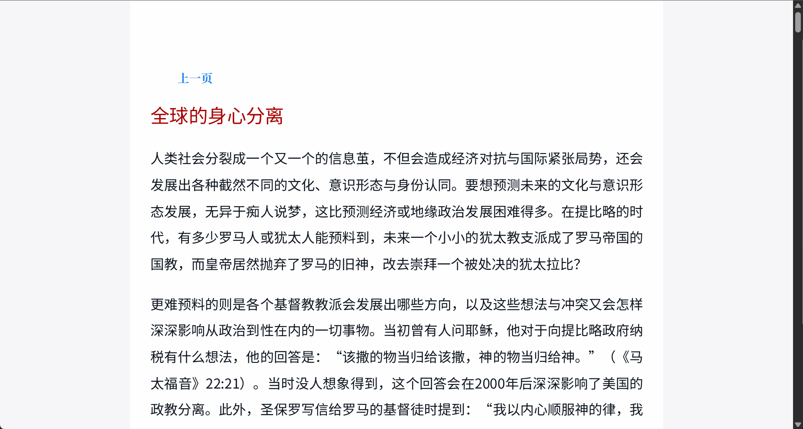
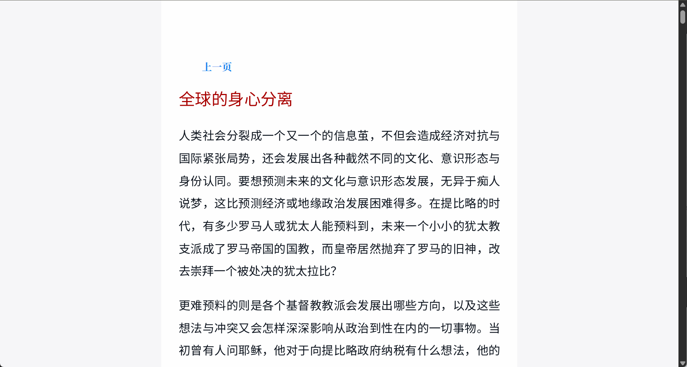
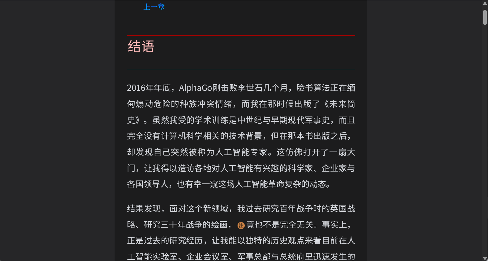
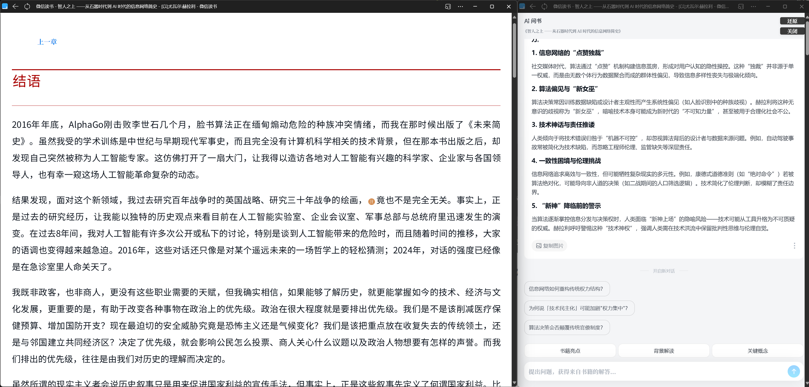

# 沉浸阅读（for微信读书）

> 为了纯粹的【全屏阅读】体验！

一句话：本脚本基于以下两个油猴脚本的思路，感谢两位作者的付出和开发。

- [微信读书Weread阅读综合功能版](https://greasyfork.org/zh-CN/scripts/490065-%E5%BE%AE%E4%BF%A1%E8%AF%BB%E4%B9%A6weread%E9%98%85%E8%AF%BB%E7%BB%BC%E5%90%88%E5%8A%9F%E8%83%BD%E7%89%88)

- [微信读书加宽可视范围和几个白色主题的护眼模式](https://greasyfork.org/zh-CN/scripts/458095-%E5%BE%AE%E4%BF%A1%E8%AF%BB%E4%B9%A6%E5%8A%A0%E5%AE%BD%E5%8F%AF%E8%A7%86%E8%8C%83%E5%9B%B4%E5%92%8C%E5%87%A0%E4%B8%AA%E7%99%BD%E8%89%B2%E4%B8%BB%E9%A2%98%E7%9A%84%E6%8A%A4%E7%9C%BC%E6%A8%A1%E5%BC%8F)

> [!NOTE] 此脚本已整合并优化了前述脚本的核心功能，建议主要参考本文档以获取最新信息和全面指引。

# 功能

1. 沉浸式UI，默认藏了顶部栏和侧边的操作按钮，操作按钮移位到最下角,移动到指定位置显示。

2. 可调整阅读视图宽度，带记忆功能，刷新页面后依然生效,可清除localStorage重置。

3. “Ai问书”可以全屏

4. 自动阅读，带翻页功能。

5. 自定义主题，带记忆功能，刷新页面后依然生效,可清除localStorage重置。

# 技巧

## 阅读布局
- main: 阅读——宽度手动调整到占满
- side：ai问书--使用“全屏”模式

